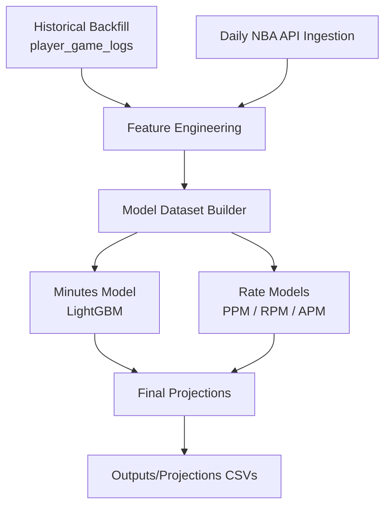

# NBA Player Projection System


**An end-to-end NBA Machine Learning Pipeline for player performance prediction**

Built by [Edwin (Ed) Bleiler](https://edwinbleiler.com) | [LinkedIn](https://www.linkedin.com/in/edwin-ed-bleiler) | [GitHub](https://github.com/edwinbleiler)

---

## Overview

The **NBA Player Projection System** is a fully automated, production-ready **Python + SQL Machine Learning pipeline** that predicts NBA player performance using:

- **Historical NBA game logs**
- **Advanced feature engineering**
- **LightGBM minutes + per-minute rate models**
- **Daily data ingestion**
- **Automated CI/CD via GitHub Actions**

The system produces **daily projections** for:
- Minutes
- Points
- Rebounds
- Assists

---

### What This System Predicts

This pipeline generates **daily per-player projections** for:

- **Minutes**
- **Points**
- **Rebounds**
- **Assists**

These are fully model-driven and updated automatically every morning via CI/CD.

---

## Example Projections

Sample daily output (abbreviated):

| Player | Team | Pred Minutes | Pred PTS | Pred REB | Pred AST |
|--------|------|--------------|----------|----------|----------|
| Jayson Tatum | BOS | 36.2 | 28.4 | 8.1 | 4.3 |
| Shai Gilgeous-Alexander | OKC | 35.7 | 29.1 | 5.3 | 6.5 |
| Luka Dončić | DAL | 37.0 | 31.2 | 9.5 | 8.7 |

Full projections are stored in:  
`outputs/projections/projections_latest.csv`

---

## Why This Project Matters

This project is designed to look and behave like a real-world analytics & machine learning system:

- It ingests real NBA data using production-style patterns
- It builds a structured feature store and model dataset
- It trains, saves, and reuses multiple models (minutes + per-minute rates)
- It automates daily runs via GitHub Actions and artifacts

For recruiters and hiring managers, this repo demonstrates:

- Data engineering skills (pipelines, schemas, incremental updates)
- Machine learning skills (feature engineering, LightGBM modeling, evaluation)
- MLOps skills (CI/CD, reproducibility, automated jobs)
- Software engineering discipline (modular structure, utilities, logging)

---

## Data Sources

This system uses:

- **nba_api** — official NBA statistics API wrapper  
- **Player game logs** from the past X seasons  
- **Daily game updates** fetched automatically at runtime  

All data is stored in a portable SQLite database under `data/`.

---

## Design Principles

This project follows modern analytics engineering standards:

- **Reproducibility** — deterministic runs, version-controlled dependencies  
- **Modularity** — ingestion, features, and models separated by responsibility  
- **Fault Tolerance** — robust retry logic for unreliable APIs  
- **Incremental Data Updates** — efficient daily pipeline instead of full reloads  

---


## Architecture



---

## Key Features

- Active Players Only (no historical noise)
- Recent Seasons Only (dynamic defaults)
- Automated Daily Ingestion
- Rolling & Rate-Based Feature Engineering
- LightGBM Machine Learning Models
- GitHub Actions CI/CD
- Portable SQLite Storage

---

## Technology Stack

- Python 3.8+
- Pandas / NumPy
- LightGBM
- scikit-learn
- nba_api
- SQLite
- GitHub Actions

---

## Project Structure

```
edwinbleiler-nba-projection-system/
├── data/
├── outputs/
│   └── projections/
├── src/
│   ├── utils/
│   ├── backfill/
│   ├── daily/
│   ├── features/
│   └── model/
├── .github/workflows/
├── requirements.txt
├── setup.sh
├── CLAUDE.md
└── README.md
```

---

## Getting Started

### Prerequisites

- Python 3.8+
- Git

### Installation

```bash
git clone https://github.com/edwinbleiler/edwinbleiler-nba-projection-system
cd edwinbleiler-nba-projection-system
bash setup.sh
```

---

## Daily Pipeline Usage

```bash
source venv/bin/activate
python -m src.daily.pull_day
python -m src.daily.ingest_day
python -m src.daily.update_features
python -m src.daily.update_model_data
python -m src.daily.run_projections
```

Outputs will appear in:

```
outputs/projections/
```

---

## Models

### Minutes Model

Predicts expected playing time based on:

- Rolling averages
- Game context
- Rest/travel

### Rate Models

For each stat, predicts:

- Points per minute
- Rebounds per minute
- Assists per minute

**Final Projections = Minutes × Rates**

---

## Feature Engineering

Includes:

- Rolling windows
- Per-minute rates
- Home/away indicators
- Rest/travel metrics
- Usage proxies

---

## Performance

Typical ranges on modern NBA data:

- Minutes MAE: 4–6 minutes
- Points rate MAE: 0.02–0.05
- Rebounds rate MAE: 0.01–0.02
- Assists rate MAE: 0.01–0.02

---

## Future Enhancements

- Opponent-adjusted projections
- Injury model integration
- Pace & defensive efficiency factors
- Dashboard visualization (Streamlit)
- REST API endpoint
- MLflow experiment tracking

---

## Skills Demonstrated

**Data Engineering**
- Designing incremental ingestion pipelines
- Working with SQLite as a lightweight data warehouse
- Implementing deduplication and schema management
- Handling external APIs with retry and logging

**Machine Learning**
- Feature engineering for time-series-like sports data
- Training LightGBM models for minutes and per-minute rates
- Evaluating model performance with appropriate metrics
- Separating training and inference concerns

**MLOps / CI/CD**
- Using GitHub Actions to run daily jobs
- Managing artifacts (database + projections)
- Ensuring reproducible environments with `requirements.txt` and `setup.sh`

**Software Engineering**
- Modular code organization under `src/`
- Reusable utility modules for logging, paths, and DB access
- Shell scripting for setup and orchestration
- Version control workflows with Git and GitHub

---

## About the Author

**Edwin (Ed) Bleiler**
Strategy & Ops • Product • Data Engineering • Machine Learning
Boston, MA

- Website: https://edwinbleiler.com
- LinkedIn: https://www.linkedin.com/in/edwin-ed-bleiler
- GitHub: https://github.com/edwinbleiler

---

## SEO Keywords

NBA Player Projection System
NBA Machine Learning Pipeline
NBA Minutes Prediction
Python SQL Machine Learning
Sports Analytics Python
NBA Player Stats Forecasting
Automated NBA Data Pipeline
Daily NBA Projections
LightGBM NBA Model
Basketball Data Engineering
Edwin Bleiler
Ed Bleiler
